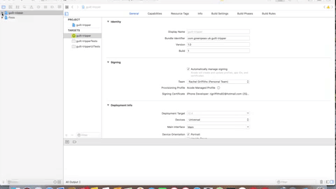
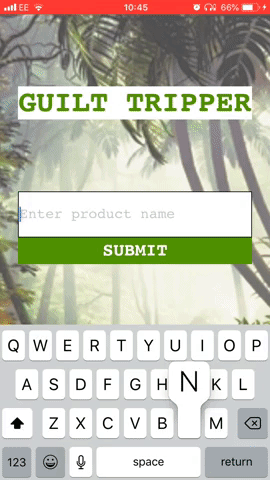
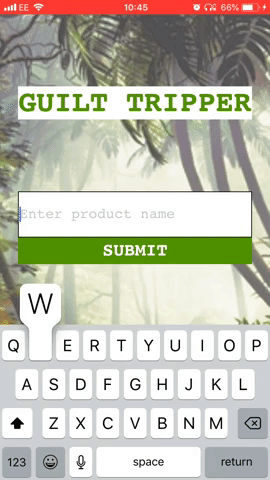
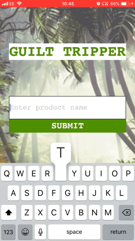

# Greenpeas UK: Guilt Tripper
--------

## Project Team
--------
* Celia From
* Papya Qureshi
* Rachel Griffiths
* Rhys Collier

## Description
--------
* An eco-friendly app that guilt-trips the user into not buying products that cause damage to the environment.

## Project Documentation
--------
* Team kanban: https://trello.com/b/u7ugVOwG/greenpeas-uk
* Team blog: https://tinyurl.com/yxbq3zeh

## Installation
--------
* Install Xcode
* Command line instructions:
 ```
  cd path/to/project/folder
  git clone git@github.com:rachjgriff/greenpeas-uk.git
  cd greenpeas-uk

  xed guilt-tripper.xcworkspace
  ```

* Press play in top left corner of Xcode screen to launch simulator
* Interact with App through simulator

## Testing
--------
* Navigate to UI (User Interface) testing file in Xcode:
  * guilt-tripper/guilt-tripperUITests/guilt_tripperUITests.swift
* To run UI tests, press diamond in line 13 of file (adjacent to ```class guilt-tripperUITests: XCTestCase```)
* DISCLAIMER: Time out issue associated with API call - if test fails, run test again.



## App Requirements
--------

#### Current Version
- [x] Enter product name
- [x] App determines whether product contains ingredient which negatively impacts the environment - palm oil
- [x] If product does not have a negative impact on the environment and is contained within our app, the user is congratulated
- [x] If the product does have a negative impact on the environment and is contained within our app:
  - [x] User is made to feel guilty through the use of images of animals being affected by this ingredient - orangutans in a destroyed forest
  - [x] User is invited to find out more about the issue
  - [x] User can read news articles related to product - palm oil
- [x] If the product is not contained within our app, user is directed to a product not found page and invited to enter another product

#### Future Version
- [ ] Check multiple products using a barcode scanner
  - [ ] Or move current array of products into a database
- [ ] Check for multiple ingredients which cause harm to the environment
- [ ] Photos displayed change dependant on what ingredient is highlighted
- [ ] Sounds are made depending on what ingredients are found e.g. applause or aggressive alarm
- [ ] Alternative products are suggested

## User Stories
--------

As an environmentally concerned shopper  
So that I can check if an item has palm oil in it  
I want to be able to open the Guilt Tripper app on my iPhone

As an environmentally concerned shopper  
So that I can check if an item has palm oil in it  
I want to push a button that takes me to a page where I can search products

As an environmentally concerned shopper  
So that I can search for a specific product to see if it contains palm oil  
I can enter the product name into a text box and submit

As an environmentally concerned shopper  
So that I am guilt-tripped into not buying the product if it contains palm oil    
I see pictures of sad orangutans in a deforested area and I can click on a 'Find Out More' button

As an environmentally concerned shopper  
So that I can read the lates news headlines about palm oil  
I am presented with a list of 3 news articles and I can click on read more '...' and this takes me to the article

As an environmentally concerned shopper  
So that I can feel good if the product doesn't contain palm oil  
I see a picture of a happy orangutan in a healthy forest and I'm congratulated

As an environmentally concerned shopper  
So that I know if the app doesn't contain a product I've searched for  
I see a message 'Product not found'

As an environmentally concerned shopper  
So that I can check another product  
I can click on 'Select Another Product'

## App Simulation
--------
##### Product contains Palm Oil:


##### Product does not contain Palm Oil:


##### Product not found:

